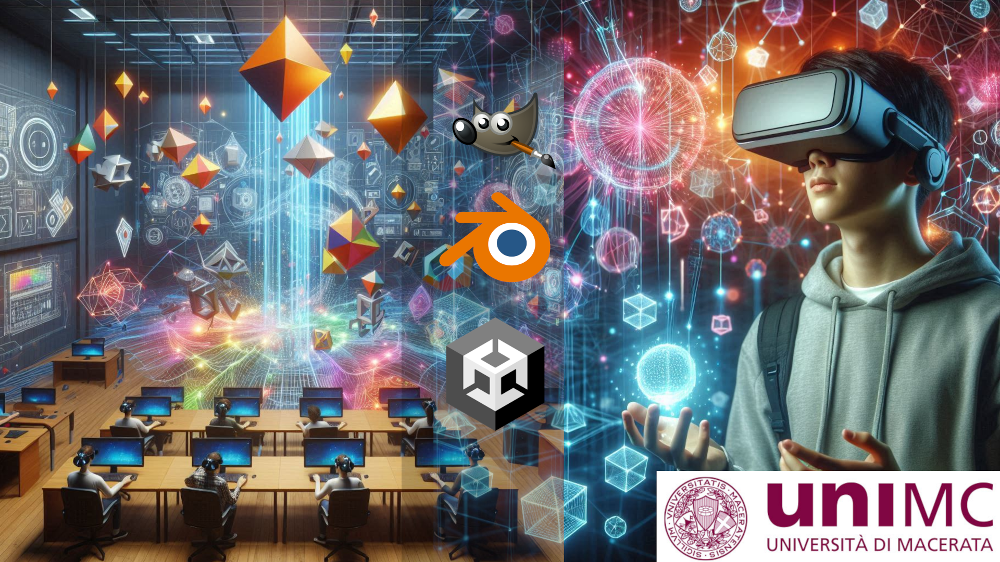

# Corso di Grafica Computerizzata e Realtà Estesa

  

## Descrizione del Corso

Al termine del corso, gli studenti saranno in grado di:

- Comprendere i concetti fondamentali della grafica 2D e 3D, spiegandone le differenze e le applicazioni principali.
- Utilizzare strumenti software come GIMP e Blender per creare e manipolare immagini 2D e modellare oggetti 3D di base.
- Avere una solida comprensione dei paradigmi di realtà estesa, distinguendo tra realtà virtuale, aumentata e mista, e identificando i loro casi d’uso nel campo dell’arte e del turismo.
- Creare spazi immersivi utilizzando Unity, implementando funzionalità di realtà virtuale.
- Acquisire conoscenze di progettazione e sviluppo di applicazioni prototipali di realtà immersiva, come Virtual Tour, testandole e perfezionandole per garantire un'esperienza utente coinvolgente.
- Presentare e discutere i propri progetti, comunicando efficacemente le idee e integrando feedback per migliorare le loro competenze e i risultati dei loro lavori.

## Prerequisiti

- Conoscenze di base di informatica.

## Contenuti del Corso

### Modulo 1: Introduzione alla Grafica Computerizzata

1. **Panoramica sulla grafica 2D e 3D**
   - Definizione e differenze tra grafica 2D e 3D
   - Strumenti Software per la Grafica 2D e 3D

2. **Introduzione a GIMP per la grafica 2D**
   - Funzionalità di base di GIMP
   - Esercitazioni pratiche: creazione e manipolazione di immagini 2D

3. **Introduzione a Blender**
   - Funzionalità di base di Blender per la grafica 3D
   - Esercitazioni pratiche: modellazione e animazione 3D

4. **Introduzione all'utilizzo di tool di Intelligenza Artificiale per la creazione di contenuti multimediali 2D/3D**

### Modulo 2: Paradigmi di Realtà Virtuale

1. **Definizione, tecnologie e casi d’uso della Realtà Estesa**
   - Realtà Virtuale (VR), Realtà Aumentata (AR) e Mista (MR)
   - Applicazioni nel mondo dell’arte e del turismo
   - Sul ruolo dell’Intelligenza Artificiale nella realtà estesa

2. **Sviluppo di Spazi Immersivi**
   - Introduzione a Unity
   - Panoramica dell'interfaccia e funzionalità principali
   - Creazione di ambienti 3D in Unity
   - Implementazione di funzionalità VR in Unity
   - Configurazione di progetti VR e integrazione con visori

3. **Progettazione e Sviluppo di Applicazioni Prototipali**
   - Progettazione di un Virtual Tour
   - Esercitazioni pratiche: sviluppo e testing di un Virtual Tour

## Obiettivi del Corso

- Fornire agli studenti una comprensione approfondita delle tecniche di grafica 2D e 3D.
- Abilitare gli studenti a creare contenuti grafici di qualità utilizzando strumenti avanzati come GIMP e Blender.
- Educare gli studenti sui concetti e le tecnologie della realtà estesa, con particolare attenzione alle applicazioni pratiche.
- Sviluppare competenze pratiche nella creazione di spazi immersivi e applicazioni VR utilizzando Unity.
- Migliorare le capacità di presentazione e discussione dei progetti, promuovendo una comunicazione efficace e un continuo miglioramento basato sul feedback.

## Installazione e Configurazione

1. **GIMP**
   - [Download GIMP](https://www.gimp.org/downloads/)
   - Installare seguendo le istruzioni per il proprio sistema operativo.

2. **Blender**
   - [Download Blender](https://www.blender.org/download/)
   - Installare seguendo le istruzioni per il proprio sistema operativo.

3. **Unity**
   - [Download Unity Hub](https://unity3d.com/get-unity/download)
   - Installare Unity Hub e utilizzare l'Hub per installare la versione di Unity richiesta dal corso ([2019.4.39f1](https://unity.com/cn/releases/editor/whats-new/2019.4.39)), includendo plug-in di sviluppo mobile.

## Esercitazioni Pratiche

Le esercitazioni pratiche saranno fornite in ciascun modulo e includeranno:

- Creazione e manipolazione di immagini 2D con GIMP.
- Modellazione e animazione 3D con Blender.
- Sviluppo di ambienti immersivi e applicazioni VR (mobile) con Unity.

## Contatti

Per qualsiasi domanda o supporto, si prega di contattare l'istruttore del corso tramite email: [lorenzo.stacchio@unimc.it]
